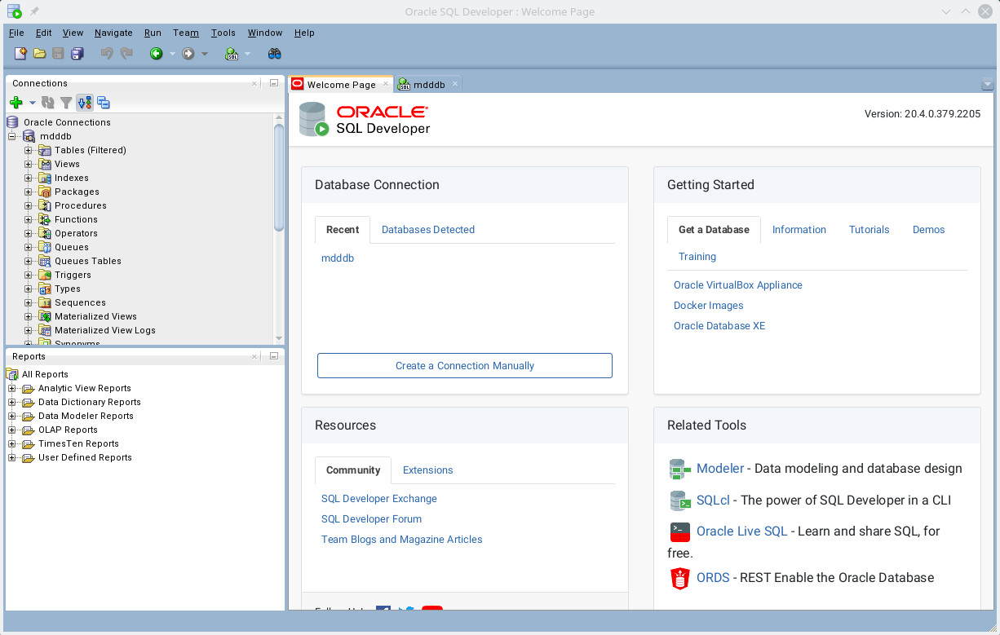

***
<div align="center">
	
	<p><b><em>Scannerverwaltungsprojekt</em></b><br/>Jakarta EE&reg; Besipielanwendung</p>
</div>

***

# Scanner

Das Demo-Projekt bietet eine Verwaltungsoberfläche zur Erfassung, Löschung, Änderung und Anzeige von Scannern.

# Technologien
Es wird die Jakarta EE `Version 10.0` verwendet. Es existieren Beispiele für folgende APIs:
- **JavaServer Faces (JSF)**: [Informationen bei Wikipedia](https://de.wikipedia.org/wiki/JavaServer_Faces)
- **Java Persistence API (JPA)**: [Informationen bei Wikipedia](https://de.wikipedia.org/wiki/Java_Persistence_API)

Die verwendete [Maven dependency](https://mvnrepository.com/artifact/jakarta.platform/jakarta.jakartaee-api/10.0.0) ist:

```xml
		<dependency>
			<groupId>jakarta.platform</groupId>
			<artifactId>jakarta.jakartaee-api</artifactId>
			<version>10.0.0</version>
			<scope>provided</scope>
		</dependency>
```

## Persistenz
<p/>
Zur Speicherung der Daten wird eine Oracle Database Express 11g verwendet.

<p/>
Installation und Start des [Docker-Containers](https://hub.docker.com/r/mcgregorandrew/oracle-xe-11g/tags):

```console
$ docker run -d --name dbmdd -p 51521:1521 -p 55500:5500 -e ORACLE_PWD=xxx -e ORACLE_CHARACTERSET=AL32UTF8 oracle/database:18.4.0-xe
$ docker exec -it --user=oracle dbmdd bash # In den Container einloggen.
```

Zugriff auf die Datenbank erfolgt über [SQL Developer](https://www.oracle.com/tools/downloads/sqldev-downloads.html):

```console
$ zypper install /home/mbeier/Downloads/sqldeveloper-20.4.0.379.2205-20.4.0-379.2205.noarch.rpm
$ /opt/sqldeveloper/sqldeveloper/bin/sqldeveloper
```


Login erfolgt dann mit dem Systembenutzer:

* Username: `sys`
* Kenwort: `xxx`
* Hostname: `localhost`
* Port: `51521` (siehe Installtion oben)
* SID: `xe` (Standardname Oracle Express)

Anlegen eines Benutzers für die Anwendung:

```sql
create tablespace mddsbts datafile 'mddsbts.dat' size 10M autoextend on;
create temporary tablespace mddsbtmpts tempfile 'mddsbtmpts.dat' size 5M autoextend on;
alter session set "_ORACLE_SCRIPT"=true;
create user mdd identified by xxx default tablespace mddsbts temporary tablespace mddsbtmpts;
grant all privileges to mdd;
```
